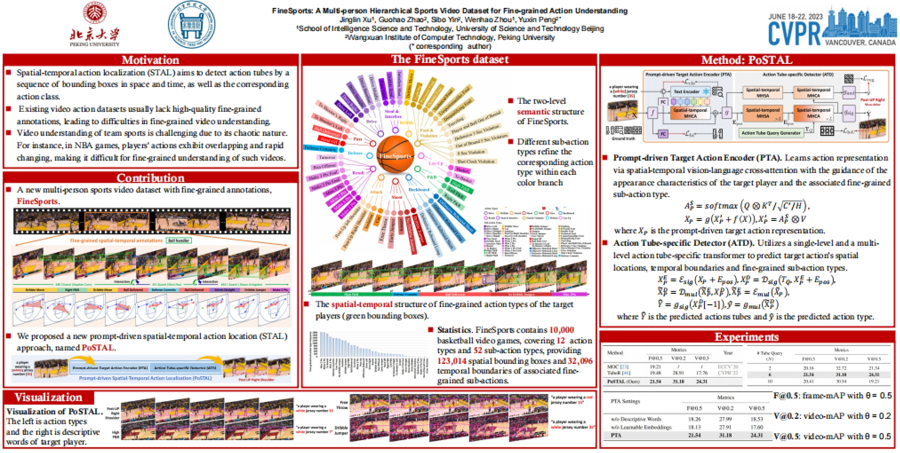
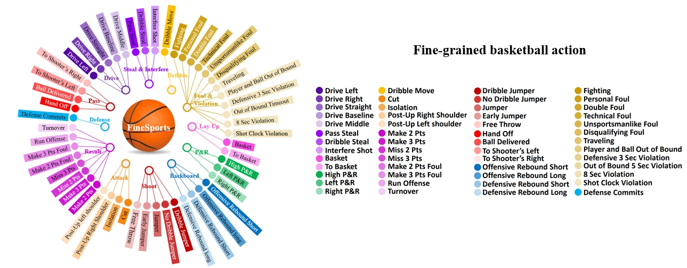

# FineSports: A Multi-person Hierarchical Sports Video Dataset for Fine-grained Action Understanding
Created by [Jinglin Xu](http://39.108.48.32/XuWebsite/), [Guohao Zhao](https://github.com/afasgafa), [Sibo Yin](https://github.com/Yanruyu-Beta/), [Wenhao Zhou](https://github.com/ZWH0413), [Yuxin Peng](http://39.108.48.32/mipl/pengyuxin/)

This repository contains the PyTorch implementation for FineSports (CVPR 2024).

[[Project Page]](https://github.com/PKU-ICST-MIPL/FineSports_CVPR2024) [[Paper]](https://openaccess.thecvf.com/content/CVPR2024/papers/Xu_FineSports_A_Multi-person_Hierarchical_Sports_Video_Dataset_for_Fine-grained_Action_CVPR_2024_paper.pdf)

## Overview

<center>
    
    <br>
    <div style="color:orange; border-bottom: 1px solid #d9d9d9;
    display: inline-block;
    color: #999;
    padding: 2px;">
  	</div>
</center>

## Requirements

Make sure the following dependencies installed (python):

* pytorch >= 1.10.1
* matplotlib=3.2.2
* einops
* timm
* tensorboardX

```
pip install -r requirements.txt
```


## Dataset & Annotations


### FineSports Download
To download the FineSports dataset, please sign the [Release Agreement](agreement/Release_Agreement.pdf) and send it to send it to Jinglin Xu (xujinglinlove@gmail.com). By sending the application, you are agreeing and acknowledging that you have read and understand the notice. We will reply with the file and the corresponding guidelines right after we receive your request!


<center>
    
    <br>
    <div style="color:orange; border-bottom: 1px solid #d9d9d9;
    display: inline-block;
    color: #999;
    padding: 2px;">
  	</div>
</center>


### Data Structure

```
$DATASET_ROOT
├── FineSports
|  ├── BallDelivered
|     ├── 00002_1
|        ├── 00001.jpg
|        ...
|        └── 00005.jpg
|     ...
|     └── 00012_1
|        ├── 00001.jpg
|        ...
|        └── 00005.jpg
|  ...
|  └── ToShootersRight
|     ├── 00095_0
|     ...
|     └── 09955_0

$ANNOTATIONS_ROOT
|  ├── FineSports-GT.pkl
```

## Training
Training on 2*NVIDIA RTX A40. Results may slightly vary due to non-fixed random seeds

To download the pre-trained feature backbone and transformer weights, please follow [CSN152](https://yzaws-data-log.s3.amazonaws.com/shared/TubeR_cvpr22/irCSN_152_ft_kinetics_from_ig65m_f126851907.mat), [DETR](https://yzaws-data-log.s3.amazonaws.com/shared/TubeR_cvpr22/detr.pth), [BLIP](https://storage.googleapis.com/sfr-vision-language-research/BLIP/models/model_large_retrieval_flickr.pth) and set `PRETRAIN_BACKBONE_DIR`, `PRETRAIN_TRANSFORMER_DIR`, `PRETRAIN_BLIP` in configuration respectively.


Train and Validation:
```bash
python train_postal_basketball.py
```

## Acknowledgments
Thanks for the [TubeR](https://github.com/amazon-science/tubelet-transformer) library, which helps us to quickly implement our ideas.

